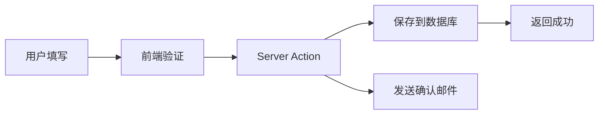

# Pixelto 首页重设计 - 需求文档

## 1. 背景与目标

### 1.1 产品定位

**品牌名称**：Pixelto  
**域名**：pixelto.com  
**Slogan**：From Pixels to Everything（像素到万物）  
**核心理念**：将每一个像素转化为无限创意可能

**品牌视觉**：
- Logo + Title + Slogan 融合设计（参考 InfoGenius Vision 风格）
- 主色调：Blue-Purple 渐变
- 字体：现代无衬线字体（Inter/Outfit）

### 1.2 产品功能

- **Phase 1（已完成）**：AI 图像编辑（Image-to-Image）
  - 智能擦除（Smart Erase）
  - 背景替换（Background Replacement）
  - 风格迁移（Style Transfer）
  - 图像增强（Image Enhancement）

- **Phase 2（规划中）**：文本生成图像（Text-to-Image）
  - 提示词生成
  - 多风格预设
  - 批量生成

### 1.3 目标用户

- **设计师**：快速原型制作、素材编辑
- **内容创作者**：社交媒体内容生成
- **普通用户**：趣味图片编辑、创意探索

---

## 2. 首页功能模块

### 2.1 Hero 区域
**目标**：吸引用户注意力，快速传达产品价值

**必须包含**：
- [ ] 主标题（H1）："Transform Your Images with AI"
- [ ] 副标题："From Pixels to Everything - Professional image editing powered by advanced AI"
- [ ] **Badge 标签**：参考图一设计（Logo + Title + Slogan 融合风格）
- [ ] **移除 CTA 按钮**（功能组件首屏直接可见）

**背景**：
- ParticleBackground 覆盖整个首屏（Hero + Editor 区域）
- 渐变叠加层确保文字可读性

**设计要点**：
- 标题使用渐变色（`bg-gradient-to-r from-blue-400 to-purple-600`）
- Badge 使用玻璃态效果（`backdrop-blur-sm bg-white/10`）
- 移动端高度：`min-h-[60vh]`，桌面端：`min-h-[80vh]`

---

### 2.2 AI Image Editor
**目标**：让用户立即体验核心功能

**当前状态**：
- ✅ 已实现基础图像编辑功能
- ✅ 已集成 Google Gemini API
- ✅ 已实现历史记录

**Phase 2.1 优化任务**：
- [ ] **移除外层装饰样式**：
  - 删除 `AIImageEditor.tsx` 中的 `rounded-3xl`、`border`、`shadow-2xl`
  - 由 `page.tsx` 控制容器样式
- [ ] **移除内部 ParticleBackground**：
  - ParticleBackground 已移至页面级别
  - Editor 使用透明背景或轻微渐变
- [ ] **浅色主题适配**：
  - 输入框背景：`bg-background/80`
  - 边框色：`border-border`
  - 文字色：`text-foreground`
- [ ] **i18n 完善**：
  - 所有 UI 文本已提取（已完成）
  - 验证多语言切换流畅性

---

### 2.3 Showcase（作品展示）
**目标**：展示 AI 编辑能力，激发用户灵感

**实施方案**：**方案 A - 预设示例图片**

**内容**：
- [ ] 标题："Creative Possibilities"
- [ ] 副标题："See what you can create with Pixelto AI"
- [ ] 预设 16-20 张高质量示例图片：
  - 智能擦除示例（4张）
  - 背景替换示例（4张）
  - 风格迁移示例（4张）
  - 综合效果示例（4张）

**布局**：
- 桌面端：4列 Grid 布局
- 平板端：3列
- 移动端：2列
- 使用 `aspect-square` 保持一致性

**交互**（Phase 2.1）：
- **Hover 效果**：
  - 图片从原图切换到编辑后
  - 显示提示词浮层（`backdrop-blur-md bg-black/50`）
  - 轻微放大（`scale-105`）
- **暂不实现**：点击 Lightbox（后续 Phase）

**图片准备**：
- 建议使用 Unsplash/Pexels 高质量图片
- 统一尺寸：1024x1024px
- WebP 格式（优化性能）
- 存储路径：`public/showcase/*.webp`

---

### 2.4 Features（功能特性）
**目标**：详细说明产品核心能力

**布局**：3列卡片（移动端单列）

**建议特性**（6个）**：
1. **🎨 智能擦除**  
   标题："Smart Object Removal"  
   描述："Effortlessly remove unwanted objects with AI precision"

2. **🌅 背景替换**  
   标题："AI Background Replacement"  
   描述："Transform scenes instantly with intelligent background swap"

3. **✨ 风格迁移**  
   标题："Artistic Style Transfer"  
   描述："Apply any art style to your images in seconds"

4. **🔍 图像增强**  
   标题："AI-Powered Enhancement"  
   描述："Automatically improve image quality and clarity"

5. **⚡ 极速处理**  
   标题:"Lightning Fast Processing"  
   描述："Get results in seconds with optimized AI models"

6. **🌍 多语言支持**  
   标题："Global Language Support"  
   描述："Use Pixelto in your preferred language"

**设计**：
- Icon：使用 Lucide Icons 或自定义 SVG
- 每个卡片包含：Icon + 标题 + 描述
- Hover 效果：轻微上浮 + 阴影增强

---

### 2.5 FAQ（常见问题）
**目标**：消除用户疑虑，提升转化

**必须包含的问题**：
1. "What is Pixelto?"
2. "How does AI image editing work?"
3. "Is my data secure?"
4. "Do I need design skills?"
5. "What file formats are supported?"
6. "Is there a free plan?"

**UI 组件**：使用 Shadcn Accordion

---

### 2.6 CTA（行动召唤）
**目标**：引导用户注册或开始使用

**内容**：
- [ ] 主标题："Ready to Transform Your Images?"
- [ ] 副标题："Join thousands of creators using Pixelto"
- [ ] 主按钮："Start Creating for Free"
- [ ] 次按钮："View Pricing"

**背景**：渐变背景（`bg-gradient-to-r from-primary to-purple-600`）

---

## 3. Header 导航

### 3.1 导航结构

```
Logo [Pixelto]  |  Pricing  |  Blog  |  Contact Us  |  About Us  |  [Login]  [Sign Up]
```

**移动端**：汉堡菜单（Drawer）

### 3.2 导航项说明

| 导航项 | 链接 | 说明 |
|--------|------|------|
| Pricing | `/pricing` | 定价页面 |
| Blog | `/blog` | 博客/文章 |
| Contact Us | `/contact` | 联系表单 |
| About Us | `/about` | 关于我们 |
| Login | `/auth/login` | 登录（已有账户） |
| Sign Up | `/auth/signup` | 注册（高亮按钮） |

---

## 4. 其他页面需求

### 4.1 Pricing 页面
**布局**：3列定价卡片（Free / Pro / Ultra）

**定价控制**：
- 使用现有的 `config/index.ts` 中的 `payments` 配置
- 复用现有的 `PricingTable` 组件，进行样式微调

| 套餐 | 月付 | 年付（优惠） | 主要功能 | 适合人群 |
|------|------|-------------|------|----------|
| **Free** | $0 | - | • 10次编辑/月<br>• 最大 1024px<br>• 标准处理速度<br>• 水印 | 个人试用 |
| **Pro** | $15/月 | $12/月 (`-20%`) | • 200次编辑/月<br>• 最大 2048px<br>• 优先处理<br>• 无水印<br>• 批量编辑 | 设计师、创作者 |
| **Ultra** | $39/month | $29/月 (`-26%`) | • 无限编辑<br>• 最大 4096px<br>• 最快处理<br>• API 访问<br>• 优先支持 | 企业、团队 |

**必须包含**：
- [ ] 月付/年付切换（参考图二样式）
  - Toggle 开关 + "Save XX%" 标签
  - 切换时价格平滑过渡动画
- [ ] 功能对比表格（展开/收起）
- [ ] 每个套餐的 CTA 按钮
  - Free: "Get Started"
  - Pro: "Upgrade to Pro" (高亮)
  - Ultra: "Contact Sales"
- [ ] FAQ (定价相关)

**技术实现**：
- 价格数据读取自 `config.payments.plans`
- 使用 `PricingTable` 组件

---

### 4.2 Blog 页面
**状态**：✅ **已完善，无需改动**

已集成 `@fumadocs/content-collections`，功能包括：
- 文章列表与详情页
- Markdown 渲染
- 代码高亮
- 分类/标签

**后续工作**：仅需在 `content/blog/` 添加内容

---

### 4.3 Contact (联系我们) 页面

**表单字段**：
- [ ] Name（必填）
- [ ] Email（必填，验证格式）
- [ ] Subject（下拉选择）：
  - General Inquiry（一般咨询）
  - Technical Support（技术支持）
  - Business Partnership（商务合作）
  - Report Issue（问题反馈）
- [ ] Message（必填，Textarea，最少 20 字符）
- [ ] **暂不添加** Turnstile CAPTCHA

**提交流程**：


**数据库表结构**：
```prisma
model ContactSubmission {
  id        String   @id @default(cuid())
  name      String
  email     String
  subject   String
  message   String   @db.Text
  status    String   @default("pending") // pending, reviewed, replied
  createdAt DateTime @default(now())
  
  @@map("contact_submission")
}
```

**邮件发送**：
- 使用 `@repo/mail` (Resend)
- 发送确认邮件到用户
- 可选：通知管理员（Slack/Email）

---

### 4.4 About Us 页面

**内容结构**：
- [ ] **使命与愿景**
  - "Empowering creativity through AI-powered image editing"
  - "Making professional image editing accessible to everyone"
- [ ] **产品介绍**
  - 技术栈（Google Gemini AI）
  - 核心功能优势
- [ ] **里程碑**（可选）
  - 产品发布时间
  - 用户数量（动态统计）
  - 处理图片数量

**布局**：
- Hero 区域：大标题 + 简介
- 3列卡片：使命/愿景/价值观
- CTA：引导用户注册或联系

---

###4.5 隐私政策 & 服务条款

**页面**：
- [ ] Privacy Policy（`/privacy`）
- [ ] Terms of Service（`/terms`）
- [ ] Cookie Policy（`/cookies`）

**实现方式**：
- Markdown 文件存储在 `content/legal/*.md`
- 使用 `@fumadocs` 渲染
- 显示最后更新时间
- 结构化目录（TOC）

**必须包含内容**（Privacy Policy）：
- 数据收集范围
- 使用目的
- 第三方服务（Google Gemini API）
- Cookie 使用
- 用户权利（GDPR/CCPA 合规）

---

### 4.6 用户页面（Dashboard）

**状态**：**延后至 Phase 3**

**规划功能**（待实现）：
- 我的作品（编辑历史）
- 账户设置
- 用量统计
- 订阅管理

---

## 5. 非功能需求

### 5.1 性能要求
- [ ] Lighthouse Score ≥ 90（所有指标）
- [ ] 首屏加载时间 < 2s（3G网络）
- [ ] Showcase 图片懒加载
- [ ] ParticleBackground 性能优化（60fps）

### 5.2 SEO 要求
- [ ] 每个页面独立 `<title>` 和 `<meta description>`
- [ ] Open Graph 元数据
- [ ] 结构化数据（JSON-LD）
- [ ] XML Sitemap 自动生成

### 5.3 可访问性
- [ ] WCAG 2.1 AA 级别
- [ ] 键盘导航支持
- [ ] ARIA 标签完整
- [ ] 颜色对比度 ≥ 4.5:1

### 5.4 国际化（i18n）
**优先语言**：
- [ ] 英语（en）- 默认
- [ ] 中文简体（zh）- 新增

**翻译覆盖**：
- 所有 UI 文本
- 页面元数据
- 表单提示

---

## 7. 实施优先级

### Phase 2.1：AI Editor 优化 + 首页核心模块（3-4天）
**目标**：完成首页核心体验

**任务清单**：
1. ✅ **AIImageEditor 优化**（1天）
   - 移除外层装饰样式
   - 移除内部 ParticleBackground
   - 浅色主题适配
   - i18n 验证

2. ✅ **首页布局重构**（1天）
   - ParticleBackground 移至首屏背景
   - Hero 组件优化（标题+副标题+Badge+CTA）
   - Editor 区域样式调整

3. ✅ **Showcase 组件**（1-2天）
   - 创建 Showcase 组件
   - 准备 16-20 张示例图片
   - 实现 Hover 效果
   - 响应式布局

### Phase 2.2：核心页面实现（2-3天）
4. ✅ **Pricing 页面**（1天）
   - 创建定价配置文件
   - 实现月/年切换
   - 定价卡片组件
   - FAQ 区域

5. ✅ **Contact Us 页面**（1天）
   - 创建表单组件
   - 实现 Server Action
   - 数据库表结构
   - 邮件发送集成

6. ✅ **About Us 页面**（0.5天）
   - 页面内容编写
   - 响应式布局

### Phase 2.3：内容与优化（1-2天）
7. ✅ **Features 组件**（0.5天）
   - 6个功能特性卡片
   - Icon + 标题 + 描述

8. ✅ **FAQ 组件**（0.5天）
   - 使用 Shadcn Accordion
   - 6-8 个常见问题

9. ✅ **CTA 组件**（0.5天）
   - 终端 CTA 区域
   - 渐变背景

10. ✅ **SEO & 性能优化**（0.5天）
    - 元数据优化
    - 图片懒加载
    - Lighthouse 优化

---

## 8. 验收标准

### 8.1 首页完成标准
- [ ] 所有模块按顺序正确显示：Hero → Editor → Showcase → Features → FAQ → CTA
- [ ] ParticleBackground 覆盖首屏，性能稳定（60fps）
- [ ] 深色/浅色主题切换perfect
- [ ] 移动端适配完美（375px - 1920px）
- [ ] AIImageEditor 在浅色主题下可读性良好
- [ ] 所有交互流畅（滚动、Hover、点击）

### 8.2 Pricing 页面完成标准
- [ ] 月/年切换动画流畅
- [ ] 价格配置正确读取
- [ ] 响应式布局完美
- [ ] CTA 按钮正确跳转

### 8.3 Contact 页面完成标准
- [ ] 表单验证正确
- [ ] 提交成功后显示确认消息
- [ ] 数据正确保存到数据库
- [ ] 确认邮件正确发送

### 8.4 性能完成标准
- [ ] Lighthouse Performance ≥ 90
- [ ] Lighthouse Accessibility ≥ 90
- [ ] Lighthouse Best Practices ≥ 90
- [ ] Lighthouse SEO ≥ 90

### 8.5 多语言完成标准
- [ ] 所有新增 UI 文本已提取到 `en.json`
- [ ] 中文翻译完成度 ≥ 80%
- [ ] 语言切换器正常工作（英语/中文）

---

> **文档版本**：v1.1  
> **创建时间**：2025-11-27  
> **最后更新**：2025-11-27  
> **维护人**：Devin  
> **状态**：✅ 需求已确认，ready for design
