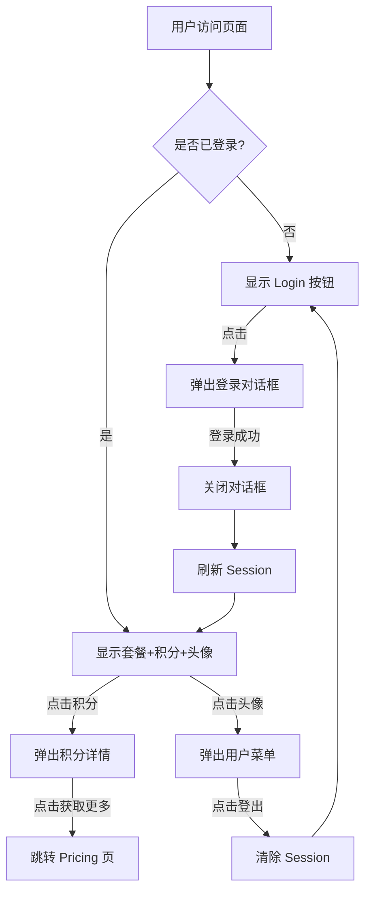

# 导航栏用户状态显示 - 需求文档

## 1. 背景与目标

当前 Marketing 导航栏在用户登录后仅显示一个 "Dashboard" 按钮，无法让用户直观了解自己的账户状态。
参考竞品设计，需要重构为显示：用户头像 + 套餐标签 + 积分余额，提升用户体验。

### 目标

1. 用户登录后可直观看到当前套餐和积分余额
2. 点击头像可快速访问账户功能
3. 点击积分可查看积分详情
4. 登录成功后保持当前页面，无需跳转

## 2. 用户体验流程

### 2.1 未登录状态
- 显示 "Login" 按钮
- 点击按钮弹出登录对话框（非跳转页面）
- 登录成功后关闭对话框，刷新导航栏状态

### 2.2 已登录状态
- 显示：[套餐标签] [积分余额] [用户头像]
- 点击积分余额：弹出积分详情弹窗
- 点击用户头像：弹出用户菜单

### 2.3 用户菜单内容
- 用户名/邮箱（头部显示）
- Upgrade 按钮
- Credits（积分余额，可跳转详情）
- Manage Account（账户设置）
- User Guide（用户指南）
- Discord（社区）
- Log Out（登出）

### 2.4 积分详情弹窗
- 总可用积分
- 每日免费积分（每日重置）
- 购买积分（永不过期）
- 促销积分（有过期时间）
- "获取更多积分"按钮

## 3. 交互流程图

## 4. 非功能需求

- **性能**：用户信息和积分数据应在 500ms 内加载完成
- **可访问性**：所有交互元素支持键盘导航
- **响应式**：移动端隐藏套餐标签，仅显示积分和头像
- **国际化**：所有文案支持多语言

## 5. 验收标准

- [ ] 登录后正确显示套餐标签、积分余额、用户头像
- [ ] 点击头像弹出完整用户菜单
- [ ] 点击积分弹出详情弹窗，显示分类积分
- [ ] 登录成功后保持当前页面不跳转
- [ ] 移动端正确响应式显示
- [ ] 第三方登录正确获取头像
- [ ] 邮箱登录自动分配 DiceBear 头像

---

> **文档版本**：v1.0
> **创建时间**：2025-12-10
> **维护人**：Claude Code
