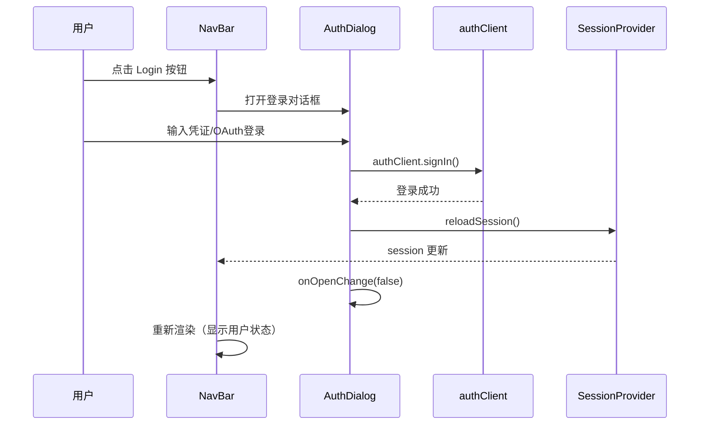
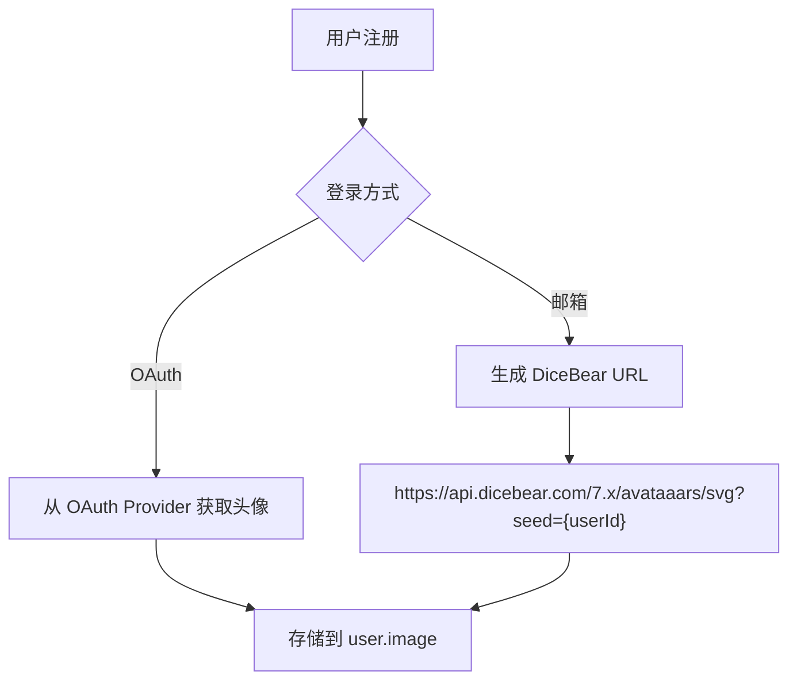

# 导航栏用户状态显示 - 技术设计

## 1. 技术架构

### 1.1 组件层次

```
NavBar (Marketing)
├── Logo
├── MenuItems
├── LanguageSwitch
├── ThemeToggle
└── UserStatusArea
    ├── [未登录] LoginButton + AuthDialog
    └── [已登录] MarketingUserStatus
                 ├── PlanBadge（套餐标签）
                 ├── CreditButton（积分按钮）
                 │   └── CreditDetailsPopover（积分详情弹窗）
                 └── UserAvatarMenu
                     └── MarketingUserMenu（用户菜单）
```

### 1.2 数据流

```
┌─────────────────────────────────────────────────────────────┐
│                        React Query                          │
│  ┌─────────────────┐      ┌─────────────────────────────┐   │
│  │  useSession()   │      │  useBillingSummary()        │   │
│  │  - user         │      │  - credits                  │   │
│  │  - session      │      │  - creditDetails            │   │
│  │  - loaded       │      │  - activePlan               │   │
│  └────────┬────────┘      └─────────────┬───────────────┘   │
│           │                             │                    │
└───────────┼─────────────────────────────┼────────────────────┘
            │                             │
            ▼                             ▼
┌─────────────────────────────────────────────────────────────┐
│                    MarketingUserStatus                      │
│  ┌──────────┐  ┌──────────────┐  ┌─────────────────────┐   │
│  │PlanBadge │  │CreditButton  │  │UserAvatarMenu       │   │
│  │(activePl)│  │(credits)     │  │(user.image/name)    │   │
│  └──────────┘  └──────────────┘  └─────────────────────┘   │
└─────────────────────────────────────────────────────────────┘
```

## 2. 流程设计

### 2.1 登录流程（弹窗模式）



### 2.2 头像分配流程



## 3. 组件设计

### 3.1 MarketingUserStatus

```typescript
// apps/web/modules/marketing/shared/components/MarketingUserStatus.tsx

interface MarketingUserStatusProps {
  className?: string;
}

export function MarketingUserStatus({ className }: MarketingUserStatusProps) {
  const { user, loaded } = useSession();
  const { data: billingSummary } = useBillingSummary(null, { enabled: !!user });

  if (!loaded || !user) return null;

  return (
    <div className={cn("flex items-center gap-3", className)}>
      <PlanBadge plan={billingSummary?.activePlan} />
      <CreditButton
        credits={billingSummary?.credits}
        creditDetails={billingSummary?.creditDetails}
      />
      <UserAvatarMenu user={user} />
    </div>
  );
}
```

### 3.2 CreditDetailsPopover

```typescript
// apps/web/modules/marketing/shared/components/CreditDetailsPopover.tsx

interface CreditDetails {
  total: number;
  dailyFree: number;
  purchased: number;
  promotional: number;
  nextExpiry: string | null;  // ISO date string
}

interface CreditDetailsPopoverProps {
  credits: number;
  creditDetails?: CreditDetails;
}
```

### 3.3 MarketingUserMenu

```typescript
// apps/web/modules/marketing/shared/components/MarketingUserMenu.tsx

// 菜单项配置
const menuItems = [
  { type: 'header', showUser: true },
  { type: 'upgrade-button' },
  { type: 'separator' },
  { type: 'link', icon: CoinsIcon, label: 'Credits', value: credits },
  { type: 'separator' },
  { type: 'link', icon: UserIcon, label: 'Manage Account', href: '/app/settings/general' },
  { type: 'link', icon: BookIcon, label: 'User Guide', href: 'https://docs.pixelto.ai' },
  { type: 'link', icon: MessageCircleIcon, label: 'Discord', href: config.contact.discord },
  { type: 'separator' },
  { type: 'button', icon: LogOutIcon, label: 'Log Out', onClick: onLogout },
];
```

## 4. 数据模型扩展

### 4.1 CreditTransaction 扩展

```prisma
// packages/database/prisma/schema.prisma

enum CreditType {
  DAILY_FREE      // 每日免费积分
  PURCHASED       // 购买积分（永不过期）
  SUBSCRIPTION    // 订阅赠送
  PROMOTIONAL     // 促销活动（有过期时间）
}

model CreditTransaction {
  // 现有字段...

  // 新增字段
  type       CreditType @default(PURCHASED)
  expiresAt  DateTime?  // null 表示永不过期
}
```

### 4.2 积分详情查询

```typescript
// packages/database/prisma/queries/credits.ts

interface CreditDetailsResult {
  total: number;
  dailyFree: number;
  purchased: number;
  promotional: number;
  nextExpiry: Date | null;
}

export async function getCreditDetailsBalance({
  userId,
  organizationId,
}: {
  userId?: string;
  organizationId?: string | null;
}): Promise<CreditDetailsResult>
```

## 5. API 设计

### 5.1 扩展 getBillingSummary

```typescript
// packages/api/modules/payments/procedures/get-billing-summary.ts

// 新增返回字段
.output(
  type<{
    credits: number;
    creditDetails: {
      total: number;
      dailyFree: number;
      purchased: number;
      promotional: number;
      nextExpiry: string | null;
    };
    activePlan: ReturnType<typeof createPurchasesHelper>["activePlan"];
  }>(),
)
```

## 6. 性能优化

- **React Query 缓存**：`useBillingSummary` 设置 `staleTime: 60 * 1000`
- **条件加载**：仅在 `user` 存在时查询 billing 数据
- **组件懒加载**：`AuthDialog` 使用 `dynamic()` 懒加载

---

> **文档版本**：v1.0
> **创建时间**：2025-12-10
> **维护人**：Claude Code
