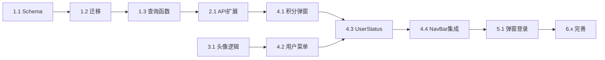

# 导航栏用户状态显示 - 实施计划

## 1. 任务清单

### Phase 1: 数据库扩展

- [x] 1.1 修改 Prisma Schema，添加 CreditType 枚举和字段
- [x] 1.2 执行数据库迁移
- [x] 1.3 扩展 getCreditDetailsBalance 查询函数

### Phase 2: API 扩展

- [x] 2.1 扩展 getBillingSummary 返回 creditDetails

### Phase 3: 头像逻辑

- [x] 3.1 在 better-auth hooks 中添加邮箱注册默认头像分配

### Phase 4: 前端组件

- [x] 4.1 创建 CreditDetailsPopover 积分详情弹窗
- [x] 4.2 创建 MarketingUserMenu 用户菜单
- [x] 4.3 创建 MarketingUserStatus 组合组件
- [x] 4.4 修改 NavBar 集成新组件

### Phase 5: 登录流程

- [x] 5.1 修改 NavBar 使用 AuthDialog 弹窗登录
- [x] 5.2 处理登录成功后 session 刷新

### Phase 6: 完善

- [x] 6.1 添加国际化文案
- [x] 6.2 响应式适配
- [x] 6.3 测试完整流程

## 2. 里程碑

| 里程碑 | 完成标志 | 状态 |
|--------|----------|------|
| M1: 后端完成 | DB Schema + API 扩展 | ⏳ 待开始 |
| M2: 组件完成 | 所有前端组件可用 | ⏳ 待开始 |
| M3: 集成完成 | NavBar 集成，登录流程正常 | ⏳ 待开始 |
| M4: 上线就绪 | 测试通过，国际化完成 | ⏳ 待开始 |

## 3. 依赖关系

## 4. 关键文件

| 文件路径 | 操作 |
|---------|------|
| `packages/database/prisma/schema.prisma` | 修改 |
| `packages/database/prisma/queries/credits.ts` | 修改 |
| `packages/api/modules/payments/procedures/get-billing-summary.ts` | 修改 |
| `packages/auth/auth.ts` | 修改 |
| `apps/web/modules/marketing/shared/components/NavBar.tsx` | 修改 |
| `apps/web/modules/marketing/shared/components/CreditDetailsPopover.tsx` | 新建 |
| `apps/web/modules/marketing/shared/components/MarketingUserMenu.tsx` | 新建 |
| `apps/web/modules/marketing/shared/components/MarketingUserStatus.tsx` | 新建 |
| `packages/i18n/translations/en.json` | 修改 |

## 5. 风险与缓解

| 风险 | 影响 | 缓解措施 |
|------|------|----------|
| 数据库迁移影响现有数据 | 中 | 设置默认值，现有记录 type=PURCHASED, expiresAt=null |
| OAuth 回调 URL 问题 | 中 | 使用现有 AuthDialog 组件，已支持弹窗模式 |
| DiceBear 服务不可用 | 低 | 使用 fallback 显示用户首字母头像 |

---

> **文档版本**：v1.0
> **创建时间**：2025-12-10
> **维护人**：Claude Code
