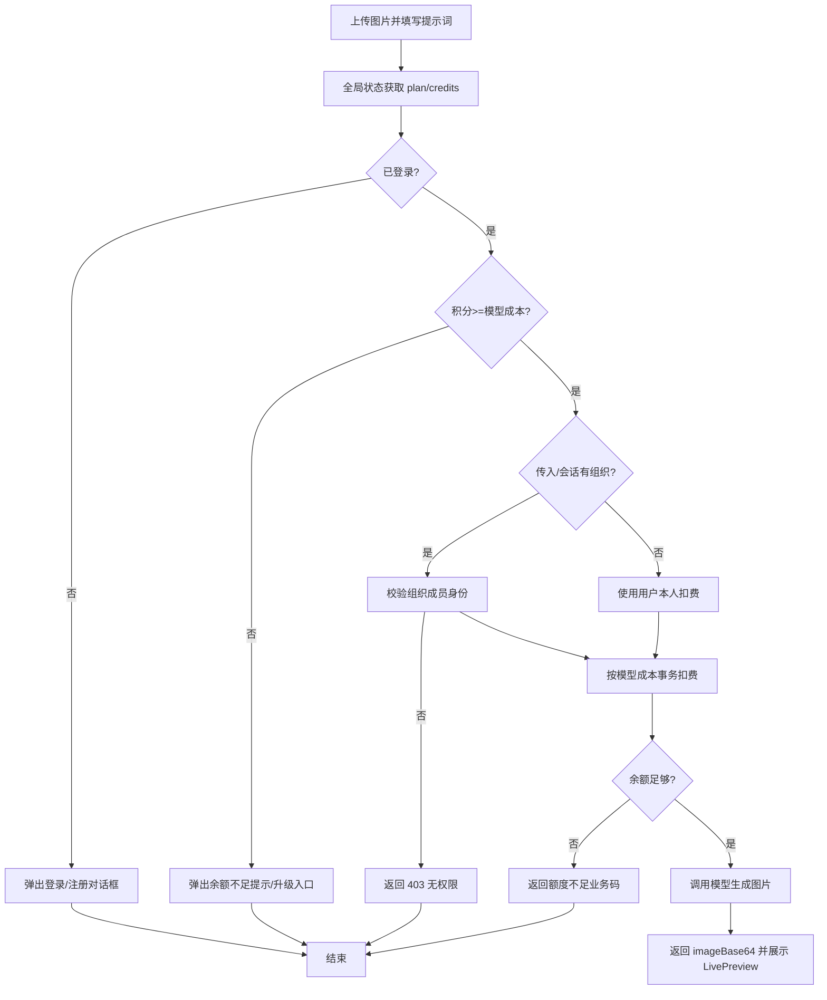

# AI 图片编辑接口与积分扣费 - 需求文档

## 1. 背景与目标
- 生图 API 新增积分扣费，但此前存在 owner 为空时跨租户扣费风险、扣费金额与前端模型展示不一致、模型默认值不一致等问题。
- 需要确保组织请求的成员校验、扣费与模型成本对齐、错误码可被前端友好展示，并提供可复现的数据库结构。
- 前端体验存在：未登录/余额不足时依然打开 LivePreview 随即闪退；全局缺少 plan/积分缓存导致无法提前阻断；登录采用整页跳转，缺少对话框体验。
- AuthDialog 体验问题：多余右侧内容栏；标题/描述重复；切换登录/注册需要复用现有表单内入口；需在头部展示积分和头像且支持 i18n；登录接口应直接返回 plan/credits 并全局维护实时更新。

**目标**：提供安全、对账准确的生图扣费链路，覆盖单人/组织模式，保证错误提示可本地化。

## 2. 用户体验流程
1. 用户在编辑器上传图片、选择模型并输入提示词。
2. 布局层获取并缓存当前用户 plan、积分余额及登录态，全局头部入口以卡片式菜单展示（参考图示），支持 i18n。
3. 点击生成前，前端用缓存的积分余额与模型成本做本地校验；余额不足直接提示充值/升级，不打开 LivePreview。
4. 未登录时弹出融合登录/注册对话框（复用现有登录/注册表单），而非整页跳转。
5. 本地校验通过后调用生图 API，服务器依据传入/会话的组织 ID 校验成员身份。
6. 通过校验后按用户或组织扣除对应模型成本的积分；额度不足返回业务错误码。
7. 模型生成图片，前端展示结果并写入本地历史。

## 3. 交互流程图

## 4. 非功能需求
- **安全**：owner 必须二选一；组织扣费需成员校验；并发扣费不超扣。
- **一致性**：模型成本与扣费金额一致；模型默认值前后端一致；全局 plan/积分缓存与服务器对齐。
- **可维护**：数据库结构可迁移；错误码固定，便于前端本地化；登录/注册对话框复用现有页面表单，减少重复代码；登录接口返回 plan/credits 以便一次性注入全局 store。
- **性能**：扣费查询使用索引，不做全表扫描；图片压缩后再上传；前端避免无效的 LivePreview 打开/关闭抖动。
- **响应一致性**：编辑图接口统一返回 `{ code, message, requestId, data }` 包装，成功 code=`SUCCESS`，data.imageBase64 承载结果，requestId 来自请求头或服务端生成。

## 5. 验收标准
- [ ] 未登录请求被拒绝并提示登录。
- [ ] 非组织成员调用组织扣费返回 403。
- [ ] owner 同时为空或同时存在时报 400，拒绝跨租户扣费。
- [ ] 不足额度返回 `INSUFFICIENT_CREDITS` 业务码。
- [ ] 模型默认值与前端一致（`gemini-2.5-flash-image`），扣费金额与模型卡一致。
- [ ] 迁移/生成可成功执行，Prisma 客户端与 schema 一致。
- [ ] 登录后全局展示 plan、积分余额、升级入口，布局参考提供的卡片样式。
- [ ] 生成前若未登录弹出对话框而非跳转页面；余额不足时不打开 LivePreview 而是提示充值。
- [ ] LivePreview 只在通过本地校验后打开，不出现“先开后关闪退”。
- [ ] AuthDialog 无右侧装饰栏，登录/注册表单内标题/描述不重复，切换入口复用表单现有文案且可切到另一表单。
- [ ] 头部 Header 显示头像（含默认头像）和积分余额，全部文案走 i18n。
- [ ] 登录接口返回 plan/credits 并写入全局状态，状态变更时 UI 实时更新。
- [ ] /ai/images/edit 成功与错误响应均携带 code/message/requestId/data，前端可用 code 本地化并用 requestId 排查。
