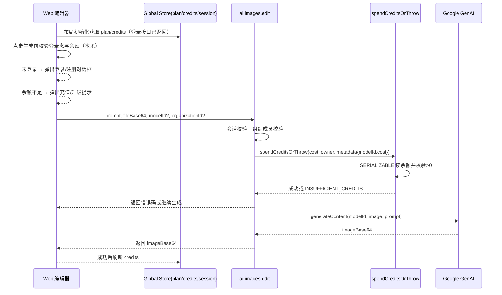

# AI 图片编辑接口与积分扣费 - 技术设计

## 1. 架构与边界
- **调用链**：`apps/web` 前端 → `packages/api/modules/ai/procedures/edit-image.ts` → `@repo/database` 扣费 → Google GenAI。
- **前端状态**：布局层获取并缓存 `session + plan + credits` 到全局 store（Context/Zustand），头部用户菜单/ Header 展示头像、邮箱、plan、Credits、升级/退出/指引入口，均通过 i18n 文案。
- **AuthDialog**：单栏布局，无右侧装饰；登录/注册切换通过表单内已有“Create an account/Have an account”文案跳转，不重复标题/描述；表单自身标题描述保留原有 i18n；登录后立即关闭弹窗并刷新全局 store。
- **权限**：组织扣费需校验成员身份；个人扣费使用当前用户；owner 必须二选一。
- **错误层级**：数据层抛业务错误码，API 层映射 ORPC 错误，前端根据 code 本地化提示。

## 2. 数据模型
- 表：`credit_transaction(id, userId?, organizationId?, amount, reason, metadata, createdAt)`。
- 约束：owner 必须二选一；amount 非 0，扣费为负数；查询/写入均按 owner 过滤。
- 并发：`SERIALIZABLE` 事务读取余额 → 校验 → 写入扣费，避免超扣。
- 索引：`userId`、`organizationId` 单列索引。

## 3. 业务/时序

## 4. API 设计
- 输入：`prompt`, `fileBase64`, `mimeType`, `modelId?`, `organizationId?`。
- 模型配置：`gemini-2.5-flash-image`（成本 4，默认，active），`flux-context`（24，未开放），`seedream`（12，未开放）。未开放模型请求返回 400。
- 扣费：按模型成本；metadata 写入 `{ modelId, cost }` 便于对账。
 - 错误映射：
   - 额度不足 → `INSUFFICIENT_CREDITS`（402）
   - owner 非法 → `INVALID_CREDIT_OWNER`（400）
   - 组织越权 → `FORBIDDEN_ORGANIZATION_ACCESS`（403）
   - 模型未开放 → `MODEL_UNAVAILABLE`（400）
   - 未配置密钥 → `GEMINI_API_KEY_MISSING`（500）
   - 生成失败 → `IMAGE_GENERATION_FAILED`（500）
- 响应结构：统一返回 `{ code, message, requestId, data }`，成功 code=`SUCCESS`、message=`OK`，data 承载 `{ imageBase64 }`；错误返回对应业务 code（如 `INSUFFICIENT_CREDITS`、`MODEL_UNAVAILABLE`），HTTP 状态与业务语义一致，requestId 来自 `x-request-id` 或服务端 `uuid`。

## 5. 前端要点
- **全局用户信息**：在顶层布局或 `AppProviders` 请求用户信息接口（登录接口返回的 session payload 包含 plan/credits），写入全局 store。Header/菜单展示头像（无头像用默认）、邮箱、plan、credits、升级/退出/指引，UI 参考提供的卡片，文案走 i18n。
- **登录/注册对话框**：单列布局，无右侧内容栏；复用现有表单组件，自身标题/描述保留；顶部无 Tabs，切换使用表单内部的“Create an account/已有账号”链接触发对话框视图切换；未登录时拦截生成操作并弹窗，不做整页跳转。
- **生成前校验**：在触发 LivePreview 前检查 `session` 与 `credits>=模型成本`；不足时弹出充值/升级提示（跳转定价页或触发支付模块），不打开 LivePreview，避免闪退。
- **LivePreview 打开时机**：仅在前端校验通过、API 请求成功返回后展示；失败保持当前编辑界面。
- **压缩上传**：压缩图片（JPEG，maxWidth 1536，q=0.85）后上传，原图用于预览。
- **模型一致性**：模型卡默认 `gemini-2.5-flash-image`，成本展示与扣费一致；未开放模型点击提示不可用。
- **错误提示**：识别 `INSUFFICIENT_CREDITS`/`PAYMENT_REQUIRED` 给出充值引导，其余走通用错误；API 返回 `requestId` 供排查。

## 6. 数据迁移策略
- 当前需求明确“仅开发环境、无数据”，采用 `prisma db push` 直接同步 schema，不保留迁移文件。
- 若后续进入共享/生产环境，应补充正式迁移并改用 `prisma migrate deploy` 保障可复现。

## 7. 验证策略
- 命令：`pnpm --filter database generate`、`pnpm --filter database push`、`pnpm lint`、`pnpm build`。
- 手动：未登录/非成员/额度不足/正常扣费四条路径；确认默认模型与扣费金额一致。
