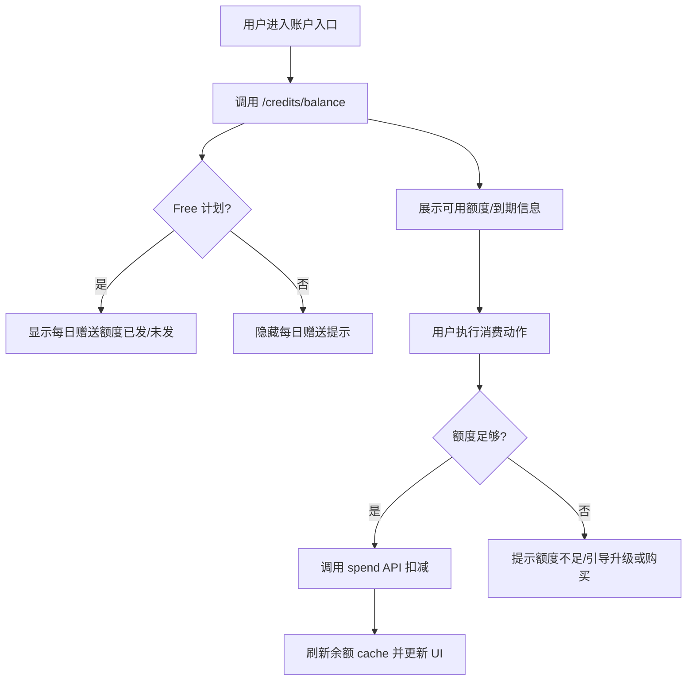

# 积分系统重构 - 需求文档

## 1. 背景与目标

- 现状：余额查询按过期过滤，但扣减未过滤，存在透支与用户看到 0 余额仍可消费的问题；schema 新增字段未落库，存在运行时缺列风险；积分类型（DAILY_FREE / PURCHASED / SUBSCRIPTION / PROMOTIONAL）语义和优先级未统一；旧表 `credit_transaction` 需淘汰。
- 目标：统一授予-扣减-过期规则，覆盖每日赠送（Free Plan）、订阅按月发放（年付也按月）、一次性购买、促销赠送；前端实时展示可用额度与到期信息；彻底迁移到新表模型，删除旧表及相关逻辑，符合行业“不可变流水 + 未过期可用额度”主流模式。

## 2. 用户体验流程

- Free 计划用户每日获得配置额度（当日有效），用完或过期后提示升级；每日定时或首请求自动发放。
- 订阅用户在账单日按月获得套餐额度（年付也是按月发放），额度一个月后过期；到期前提示消耗。
- 购买一次性积分的用户获得永久有效额度（不设置过期），可持续消费。
- 促销赠送在特定活动时发放，与套餐截止时间一致过期。
- 前端在账户入口实时显示可用总额、非过期额度、即将到期时间、当日免费额度，用 Usage details 查看明细。

## 3. 交互流程图

## 4. 非功能需求

- 并发安全：扣减需事务/行锁，禁止透支。
- 可审计：所有授予与消费有不可变流水，能追溯来源和消费指向。
- 性能：余额查询和扣减在 P99 < 200ms，支持缓存/视图加速。
- 可靠性：字段/索引通过迁移落库，缺失即阻断发布；旧表删除后不再被代码访问。
- 国际化：仅维护 `en` 文案，其余按流程同步。

## 5. 验收标准

- [ ] 扣减只使用未过期额度，过期积分不可消费。
- [ ] DAILY_FREE 防重复发放（按天唯一），仅 Free 计划发放。
- [ ] SUBSCRIPTION 月度发放按账单日执行，年付也是按月发放。
- [ ] PURCHASED 永不过期（默认），PROMOTIONAL 随活动/套餐到期。
- [ ] 余额接口返回各类型可用额度、下次到期时间、当日免费额度。
- [ ] 前端展示与 API 数据一致，消费后 UI 余额自动刷新或失效重拉。
- [ ] 迁移成功落库 type/expiresAt/索引，无缺列错误；旧表 `credit_transaction` 及相关逻辑下线删除。
- [ ] DAILY_FREE 与 SUBSCRIPTION 发放有定时调度或懒发逻辑，防重复发放。

---

> **文档版本**：v1.0  
> **创建时间**：2024-12-09  
> **维护人**：团队/负责人待定
