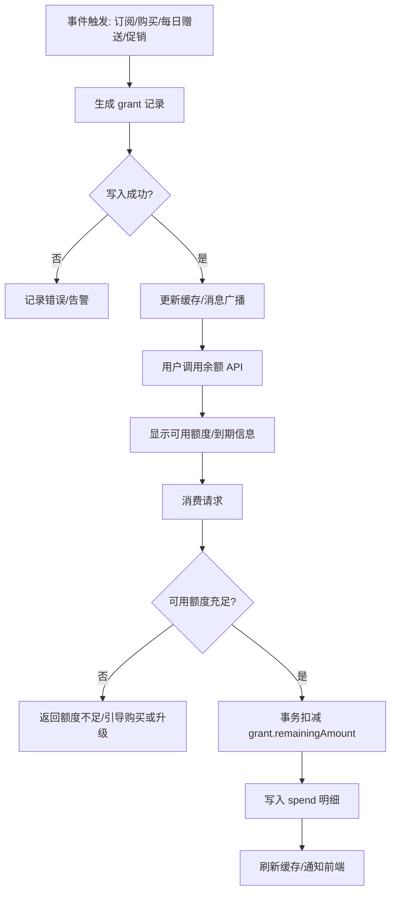
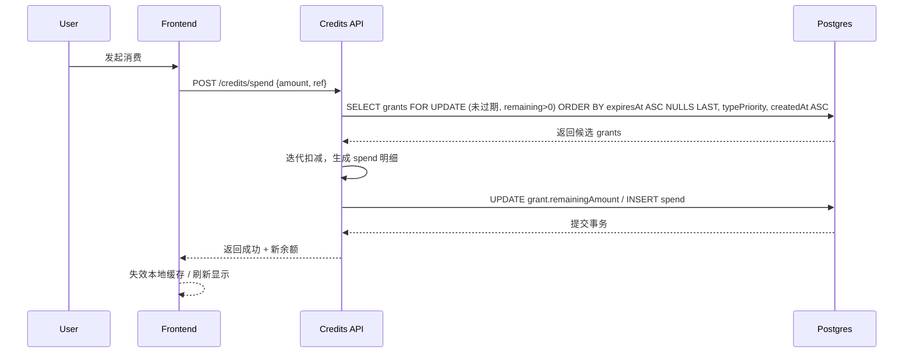

# 积分系统重构 - 技术设计

## 1. 技术架构

- 持久层：Prisma + PostgreSQL，采用“授予 + 消费”两表模型（主流记账模式），所有余额/扣减都基于未过期授予的 `remainingAmount` 计算，旧表 `credit_transaction` 及相关读写逻辑全部删除。
- 服务层：`creditsService` 统一封装授予/扣减/查询，暴露 oRPC/HTTP API；扣减使用事务 + `FOR UPDATE` 防并发透支。
- 前端：通过 `GET /api/credits/balance` 实时拉取余额，SWR/React Query 缓存 + 消费后失效重拉；UI 参考提供的卡片，展示总可用、下次到期、非过期额度、每日赠送状态。

## 2. 流程设计

### 2.1 业务流程图（授予/消费/过期）



### 2.2 时序图（扣减 FEFO）



### 2.3 定时/懒发放流程

- DAILY_FREE（仅 Free Plan）：每日 00:05 定时任务发放；若用户当日首次请求余额/消费且尚未发放，则懒发一次；唯一键 `(userId, date, type)` 防重复。
- SUBSCRIPTION（月/年）：按账单日（或订阅创建日对齐）每月定时任务发放当月额度；年付同样按月发放；`expiresAt = billedAt + 1 month`。
- PURCHASED / PROMOTIONAL：事件驱动发放（订单、活动触发）。

## 3. 数据模型

### 3.1 表结构（推荐）

- `credit_grant`（授予）
  - `id` PK, `userId` FK
  - `amount` 正向授予额度
  - `remainingAmount` 可用额度（扣减时递减）
  - `type` enum: DAILY_FREE | PURCHASED | SUBSCRIPTION | PROMOTIONAL
  - `expiresAt` 可空（PURCHASED 默认 NULL）
  - `sourceRef` 引用发放来源（订单/订阅周期/活动）
  - `metadata` JSONB 可选
  - 索引：`(userId, expiresAt, remainingAmount)`、`(userId, type)`、`(userId, expiresAt)`

- `credit_spend`（消费明细）
  - `id` PK, `userId` FK
  - `grantId` FK -> credit_grant
  - `amount` 消费额度（正数）
  - `spendRef` 消费来源（如作业/订单 id）
  - `createdAt`
  - 索引：`(userId, createdAt)`、`(grantId)`

> 不再兼容旧的 `credit_transaction` 单表，迁移后直接删除该表与相关代码。

### 3.2 类型语义与发放规则

- DAILY_FREE：配置来源 `config/index.ts` 的 `plan.free.dailyCredits`，仅 Free Plan 用户；`expiresAt` 当天 23:59:59；唯一键 `(userId, date, type)` 防重复；触发方式：每日定时任务或用户首请求懒发。
- SUBSCRIPTION：套餐（月/年）在“账单日”发放当月额度，`expiresAt = billedAt + 1 month`；年付也是按月发放；`sourceRef = subscription_cycle_id`。
- PURCHASED：一次性购买，`expiresAt` 默认 NULL（永久有效）；`sourceRef = order_id`；如需“长期到期”，可配置全局上限。
- PROMOTIONAL：活动或年付赠送，`expiresAt = 套餐截止时间或活动设定`；`sourceRef = campaign_id`。

### 3.3 扣减优先级（行业习惯 + 需求融合）

- 规则：FEFO（最早过期先扣）为主排序，类型优先级：`DAILY_FREE`（当日失效，应最先消耗） > `SUBSCRIPTION` > `PROMOTIONAL` > `PURCHASED`。  
  - 说明：SUBSCRIPTION > PROMOTIONAL > PURCHASED 满足用户付费/订阅优先的预期；DAILY_FREE 仅 Free Plan 生效且当日过期，提升优先级避免浪费。若未来需要调整，可通过配置化映射。

### 3.4 余额计算

- 仅汇总 `credit_grant` 中 `expiresAt IS NULL OR expiresAt > now()` 且 `remainingAmount > 0` 的行。
- 返回字段：`totalAvailable`、`byType`、`nextExpireAt`（最近非 NULL 到期时间及其额度）、`dailyFree`（已发/未发/可发额度）。
- 缓存：可选 Redis（key: `credits:balance:{userId}`），写路径（授予/扣减）同步删除缓存。

## 4. API 设计（示例）

- `GET /api/credits/balance`
  - 返回：`totalAvailable`, `byType`, `nextExpireAt`, `nonExpiring`, `dailyFree: {granted, amount, expiresAt}`
- `POST /api/credits/spend`
  - 入参：`amount`, `reason`, `spendRef`；逻辑：事务扣减 FEFO，返回新余额。
- `POST /api/credits/grant`（内部/后台）
  - 入参：`amount`, `type`, `expiresAt?`, `sourceRef`, `userId`
- `GET /api/credits/usage`
  - 返回最近 N 条授予/消费明细（供 “Usage details” 展示）

## 5. 前端设计要点（参照示例卡片）

- 数据获取：SWR/React Query 调用 `/api/credits/balance`，成功后渲染卡片；消费后 `invalidateQueries('credits-balance')`。
- 展示字段：
  - 可用总额（闪电图标）、非过期额度、非过期到期时间。
  - Non-Expiring（无过期）额度单独列出。
  - Free Daily Credits：显示今日赠送额度，文案“Free {daily} credits renews daily”。
  - CTA：Upgrade / Purchase 根据套餐状态显示。
- 空/异常：余额加载失败时提示重试，保持按钮 disabled。

## 6. 性能与可靠性

- 扣减查询使用 `(userId, expiresAt, remainingAmount)` 覆盖索引，限制候选行分页（如取前 50 条）；事务提交前校验总扣减量。
- 避免读写分叉：余额/扣减共用同一过滤条件（未过期 + remaining > 0）。
- 监控：透支异常、DAILY_FREE 重复发放、迁移缺列报警。

## 7. 迁移与兼容

- Prisma schema 需新增 `CreditType` enum、`type`/`expiresAt`/`remainingAmount` 等字段，并生成 migration；生产用 `prisma migrate deploy`。
- 删除旧表：迁移中删除 `credit_transaction` 表与相关索引；代码同时移除旧查询/扣减逻辑。
- 兼容迁移脚本（可选）：如需保留历史，可在删除前将正向流水写入 `credit_grant`（`remainingAmount=amount`，类型按来源映射，PURCHASED 默认无过期）；负向流水可选重放为 `credit_spend`。
- 校验：迁移后执行余额重算脚本，比对 UI 显示与 DB。

## 8. 运维与补偿（无退款场景）

- 手动补发订阅额度：
```sql
INSERT INTO credit_grant (id, user_id, amount, remaining_amount, type, expires_at, source_ref)
VALUES (gen_random_uuid(), :userId, :amount, :amount, 'SUBSCRIPTION', now() + interval '1 month', :subscription_cycle_id);
```

- 手动补发每日赠送（若漏发）：
```sql
INSERT INTO credit_grant (id, user_id, amount, remaining_amount, type, expires_at, source_ref)
SELECT gen_random_uuid(), :userId, :daily, :daily, 'DAILY_FREE', date_trunc('day', now()) + interval '1 day' - interval '1 second', 'daily-YYYYMMDD'
WHERE NOT EXISTS (
  SELECT 1 FROM credit_grant
  WHERE user_id = :userId AND type = 'DAILY_FREE' AND expires_at::date = current_date
);
```

- 手动扣除多发额度：
```sql
UPDATE credit_grant
SET remaining_amount = GREATEST(0, remaining_amount - :deduct)
WHERE id = :grantId;
```

---

> **文档版本**：v1.0  
> **创建时间**：2024-12-09  
> **维护人**：团队/负责人待定
