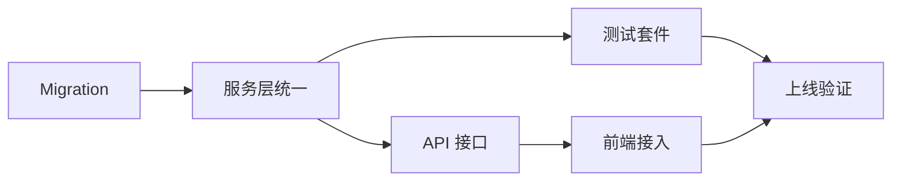

# 积分系统重构 - 实施计划

## 1. 任务清单

### 阶段一：数据与迁移
- [x] 补充 Prisma schema（CreditType enum、credit_grant/credit_spend 字段与索引）
- [x] 生成并审阅 migration：创建新表/索引，删除旧表 `credit_transaction`
- [x] 历史数据回填脚本（删除前导出并导入新表，按需重放负向）
- [x] 余额重算校验脚本（DB 与 UI 对比）

### 阶段二：服务层与业务规则
- [x] 实现 `creditsService`: grantCredits, spendCreditsOrThrow (FEFO + 类型优先级), getBalance
- [x] DAILY_FREE 发放逻辑（每日定时 + 首请求懒发，唯一键防重复，仅 Free Plan）
- [x] SUBSCRIPTION 周期发放（账单日/月度定时，年付按月发放）
- [x] PROMOTIONAL/PURCHASED 发放接口（内部/后台）
- [x] 缓存/并发控制（事务 + `FOR UPDATE`，写后失效缓存）

### 阶段三：API 与前端
- [x] API: `GET /api/credits/balance`, `POST /api/credits/spend`, `GET /api/credits/usage`
- [x] 前端卡片实现（参考设计图：总额、非过期、到期时间、Daily Free 区块）
- [x] 前端数据层：SWR/React Query，消费后失效刷新；错误兜底

### 阶段四：验证与上线
- [x] 单元/集成测试：过期扣减、类型优先级、并发透支、防重复发放
- [x] e2e：用户消费流程、余额展示、Daily Free 发放/用尽
- [x] 观察与告警：缺列/迁移失败、透支异常、Daily Free 重复
- [x] 运维手册：补偿 SQL、常见问题

## 2. 里程碑

| 里程碑 | 完成标志 | 状态 |
|--------|----------|------|
| M1: 迁移落库 | migration 合并并在预生产验证通过 | ⏳ 待开始 |
| M2: 服务完成 | grant/spend/balance 服务上线，FEFO 优先级可用 | ⏳ 待开始 |
| M3: 前端完成 | 余额卡片上线，接口接入完成 | ⏳ 待开始 |
| M4: 上线就绪 | 测试通过，监控/补偿手册到位 | ⏳ 待开始 |

## 3. 依赖关系

## 4. 风险与缓解

| 风险 | 影响 | 缓解措施 |
|------|------|----------|
| 迁移未落库/缺列 | 生产请求报错 | 在预生产跑 `migrate deploy`，CI 阻断无 migration 的 schema 变更 |
| 并发透支 | 余额为负、资金风险 | 扣减事务化，`FOR UPDATE`，候选行分页，扣减总额校验 |
| Daily 免费重复发放 | 成本浪费 | 唯一键 + 幂等检查，发放前查询当日记录 |
| 前端缓存过期导致误展示 | 误导用户 | 消费成功后失效缓存，关键流程前强制刷新 |
| 类型优先级误配置 | 不符合业务预期 | 以配置/常量集中管理优先级，灰度验证 |

---

> **文档版本**：v1.0  
> **创建时间**：2024-12-09  
> **维护人**：团队/负责人待定
