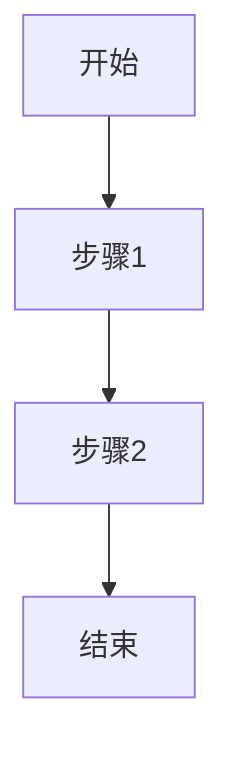

# 技术规格文档索引

本目录用于存放所有功能需求、架构设计和实施计划文档。

---

## 📂 文档结构

文档按业务域分类管理，每个业务域独立编号：

```
docs/specs/
├── 01-ui-components/       # UI 组件库
│   ├── 001-button-system/
│   └── 002-form-controls/
├── 02-features/            # 功能模块
│   ├── 001-user-auth/
│   └── 002-dashboard/
├── 03-integrations/        # 第三方集成
│   └── 001-ai-chat/
└── 04-infrastructure/      # 基础设施
    └── 001-i18n-routing/
```

---

## 🗂️ 业务域分类

### 前端项目常见业务域

| 业务域类型 | 说明 | 示例 |
|---------|------|------|
| **UI 组件库** | 通用 UI 组件系统 | `01-ui-components` |
| **核心功能** | 主营业务功能模块 | `02-features` |
| **第三方集成** | 外部服务集成 | `03-integrations` |
| **基础设施** | 技术基础设施 | `04-infrastructure` |

> **提示**：请根据实际项目业务调整业务域分类。

---

## 📋 文档规范

### 1. 功能文档结构

每个功能遵循以下结构：

```
{业务域}/{序号}-{feature-name}/
├── README.md               # 功能概述（可选）
├── 1.requirements.md       # 需求文档
├── 2.design.md            # 技术设计
└── 3.plan.md              # 实施计划
```

### 2. 命名规范

- **业务域**：`01-domain-name`（两位数字 + 小写 + 连字符）
- **功能目录**：`001-feature-name`（三位数字 + 小写 + 连字符）
- **文件名**：`1.requirements.md`、`2.design.md`、`3.plan.md`

### 3. 文档职责

#### 📝 requirements.md - 需求文档

**包含内容**：
- 背景与目标
- 用户体验流程（User Flow）
- 交互流程图（Flowchart）
- 非功能需求（性能、可访问性、SEO）
- 验收标准

#### 🎨 design.md - 技术设计

**包含内容**：
- 技术架构图
- 组件设计（Props、状态管理）
- 时序图（组件/API 交互）
- 数据模型（TypeScript 类型）
- UI 设计要点（布局、响应式）
- 性能考虑（代码分割、懒加载）

#### 📅 plan.md - 实施计划

**包含内容**：
- 组件/页面清单（checkbox）
- 验收标准
- 时间表
- 风险与缓解措施

---

## 📝 文档模板

### 功能 README.md（可选）

```markdown
# {功能名称}

## 概述

{一句话描述}

## 文档导航

- [需求文档](./1.requirements.md)
- [技术设计](./2.design.md)
- [实施计划](./3.plan.md)

## 状态

- ✅ 需求评审通过
- ✅ 设计完成
- 🔄 开发中
- ⏳ 待测试
```

### requirements.md

```markdown
# {功能名称} - 需求文档

## 1. 背景与目标

{描述为什么要做这个功能}

## 2. 用户体验流程

{描述用户如何使用这个功能}

## 3. 交互流程图



## 4. 非功能需求

- **性能**：{性能要求}
- **可访问性**：{无障碍要求}
- **SEO**：{SEO 要求}
- **响应式**：{移动端适配要求}

## 5. 验收标准

- [ ] 功能正常
- [ ] 性能达标
- [ ] 移动端适配

---

> **文档版本**：v1.0  
> **创建时间**：{日期}  
> **维护人**：{姓名}
```

### design.md

```markdown
# {功能名称} - 技术设计

## 1. 技术架构

{系统架构图}

## 2. 组件设计

### 2.1 组件树

```
ParentComponent
├── ChildA
└── ChildB
```

### 2.2 Props 接口

```typescript
interface ComponentProps {
  // Props 定义
}
```

## 3. 数据流

{描述数据如何在组件间流动}

## 4. 性能优化

- 代码分割
- 懒加载
- 缓存策略

---

> **文档版本**：v1.0  
> **创建时间**：{日期}  
> **维护人**：{姓名}
```

### plan.md

```markdown
# {功能名称} - 实施计划

## 1. 组件清单

**基础组件（3 个）**：
- [ ] Button 组件
- [ ] Input 组件
- [ ] Dialog 组件

**业务组件（5 个）**：
- [ ] LoginForm 组件
- [ ] UserCard 组件
- [ ] ...

## 2. 验收标准

- [ ] 功能完整
- [ ] 性能达标
- [ ] 可访问性合规

## 3. 时间表

| 阶段 | 开始日期 | 结束日期 | 负责人 |
|------|---------|---------|--------|
| 设计 | {日期}  | {日期}  | {姓名} |
| 开发 | {日期}  | {日期}  | {姓名} |
| 测试 | {日期}  | {日期}  | {姓名} |

---

> **文档版本**：v1.0  
> **创建时间**：{日期}  
> **维护人**：{姓名}
```

---

## 🚀 创建新文档

### 步骤

1. **确定业务域**：选择合适的业务域
2. **分配序号**：使用下一个可用序号（如 002）
3. **创建目录**：`mkdir {业务域}/{序号}-{feature-name}`
4. **复制模板**：创建 `1.requirements.md`、`2.design.md`、`3.plan.md`
5. **填写文档**：按需求 → 设计 → 计划顺序填写

### 示例

```bash
# 在 01-ui-components 下创建新功能
cd docs/specs/01-ui-components

# 查看当前最大序号
ls -d [0-9]*

# 创建新功能目录
mkdir 003-modal-system
cd 003-modal-system

# 创建文档
touch README.md 1.requirements.md 2.design.md 3.plan.md
```

---

> **文档版本**：v1.0  
> **创建时间**：{创建日期}  
> **最后更新**：{更新日期}  
> **维护人**：{团队/负责人}  
> **说明**：技术规格文档规范与索引
