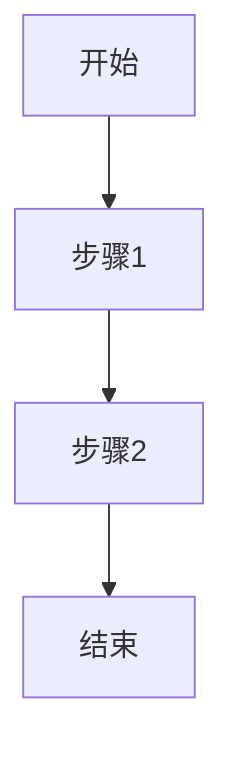

# {功能名称} - 需求文档

## 1. 背景与目标

{描述为什么要做这个功能，解决什么问题}

## 2. 用户体验流程

{描述用户如何使用这个功能}

## 3. 交互流程图

## 4. 非功能需求

- **性能**：{性能要求}
- **可访问性**：{无障碍要求}
- **SEO**：{SEO 要求}
- **响应式**：{移动端适配要求}

## 5. 验收标准

- [ ] 功能正常
- [ ] 性能达标
- [ ] 移动端适配

---

> **文档版本**：v1.0
> **创建时间**：{日期}
> **维护人**：{姓名}
