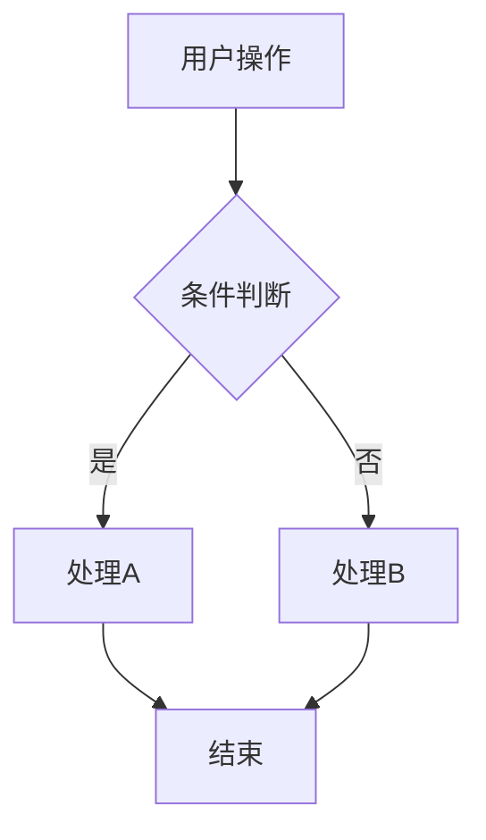
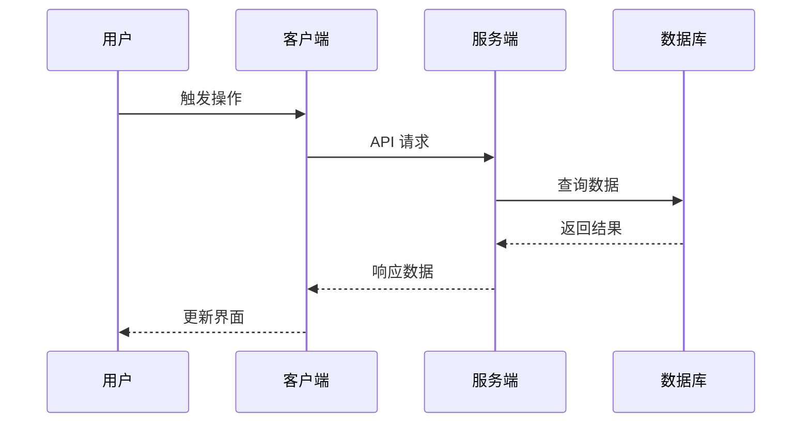

# {功能名称} - 技术设计

## 1. 技术架构

{系统架构图，可使用 mermaid}

## 2. 流程设计

### 2.1 业务流程图

{用户操作的完整业务流程}



### 2.2 时序图

{组件/服务间的交互时序}



## 3. 组件设计

### 3.1 组件树

```
ParentComponent
├── ChildA
└── ChildB
```

### 3.2 Props 接口

```typescript
interface ComponentProps {
  // Props 定义
}
```

## 4. 数据流

{描述数据如何在组件间流动，状态管理方案}

## 5. API 设计

{如涉及后端接口，描述 API 契约}

## 6. 性能优化

- 代码分割策略
- 懒加载方案
- 缓存策略

---

> **文档版本**：v1.0
> **创建时间**：{日期}
> **维护人**：{姓名}
