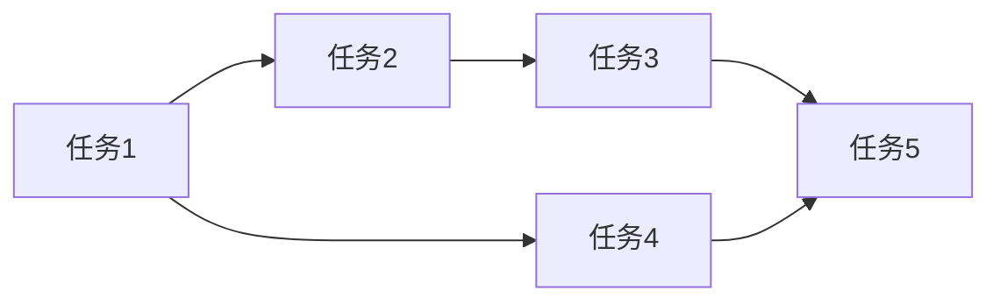

# {功能名称} - 实施计划

## 1. 任务清单

### 阶段一：基础搭建

- [ ] 任务 1
- [ ] 任务 2

### 阶段二：核心功能

- [ ] 任务 3
- [ ] 任务 4

### 阶段三：优化完善

- [ ] 任务 5
- [ ] 任务 6

## 2. 里程碑

| 里程碑 | 完成标志 | 状态 |
|--------|----------|------|
| M1: 基础搭建 | 项目结构创建，依赖安装完成 | ⏳ 待开始 |
| M2: 核心功能 | 主要功能可用 | ⏳ 待开始 |
| M3: 上线就绪 | 测试通过，文档完善 | ⏳ 待开始 |

## 3. 依赖关系

## 4. 风险与缓解

| 风险 | 影响 | 缓解措施 |
|------|------|----------|
| {风险描述} | 高/中/低 | {缓解措施} |

---

> **文档版本**：v1.0
> **创建时间**：{日期}
> **维护人**：{姓名}
